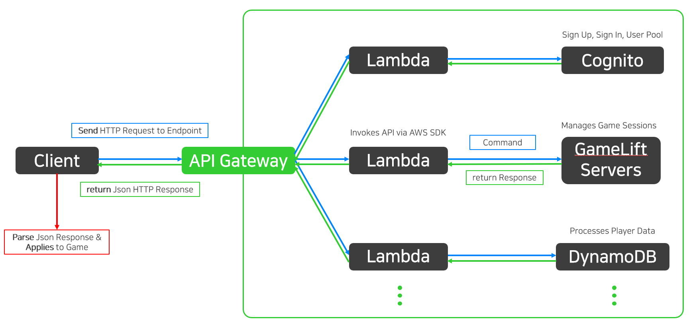
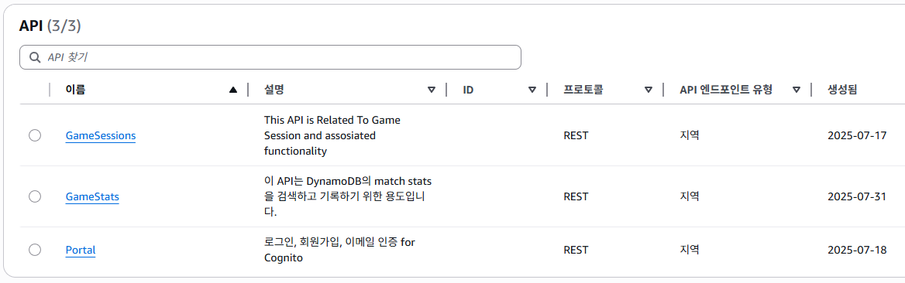

# Unreal Engine Dedicated Server 프로젝트
## 플레이 영상


## 프로젝트 소개
해당 프로젝트는 FPS 게임에 데디케이티드 서버 모듈을 추가, AWS 서비스를 이용해 실시간 네트워크 동기화 외에도 회원가입 및 로그인, DB를 활용한 플레이 기록 및 랭킹 시스템을 구현했습니다.

## 작업 개요
1. C++ 기반 데디케이티드 서버(Dedicated Server) 모듈 구현
2. AWS GameLift Anywhere/EC2 Fleet을 활용한 게임 세션 관리 및 서버 배포
3. API Gateway, Lambda, DynamoDB 기반의 **서버리스(Serverless)** 백엔드 아키텍처 구축
4. AWS Cognito 연동을 통한 안전한 **회원가입/로그인** 시스템 구현
5. NoSQL(DynamoDB) 기반 데이터 모델링 및 랭킹 시스템 구축
6. CloudWatch를 통한 실시간 서버 로그 추적 및 에러 원인 분석
7. IAM 최소 권한 원칙에 따른 서비스별 접근 제어 및 보안 강화
8. **심리스 서버 트래블(Seamless Server Travel)** 구현으로 맵 이동 시 끊김 없는 플레이 경험 제공
9. UMG를 활용한 UI 제작
10. ```Data Asset```과 ```Gameplay Tag```를 활용한 유연한 API 엔드포인트 관리 시스템 설계
11. 언리얼 리플렉션 시스템 기반 **JSON 데이터 자동 파싱(Deserialize)** 기능 구현
12. ```PlayerState```을 활용하여 서버 트래블 간 플레이어 데이터 영속성 확보
13. ```LocalPlayerSubsystem``` 토큰 정보 저장 및 주기적인 액세스 토큰 갱신
14. ```GameState``` 및 ```Fast TArray``` 직렬화를 이용한 **실시간 접속자 목록 표시**
15. **핑퐁(Ping-Pong) 방식의 RTT(왕복 시간) 계산을 통한 클라이언트-서버 간 타이머 동기화** 
16. ```PlayerState```를 이용한 플레이어 정보(점수, 상태 등) 실시간 복제 및 게임 결과 기록
17. **델리게이트 전파(Broadcast)을 이용한 위젯과 게임 로직 간 결합도 최소화(Decoupling) 설계** 


## 구현 상세
### AWS 기반 서버리스 게임 백엔드 아키텍처

<p align="center">
 
</p>

* 서버리스(Serverless) 아키텍처 : 서버 관리에 대한 부담 없이 로직 구현에만 집중
* 단일 진입점 : 모든 요청을 API Gateway 한 곳으로 집중하여 트래픽 모니터링, 로그 수집 등 중앙에서 제어하고 내부 시스템 구조는 숨겨 보안 강화
* 최소 권한 원칙 : Lambda Function은 IAM 정책을 통해 단일 로직만 처리할 수 있는 최소한의 권한만 부여, 다른 시스템 또는 동일 시스템 내 다른 요청 수행 불가
* 다중 방어 체계 구축 : 비정상 네트워크 접근 차단(API Gateway), 사전 정의된 로직만 처리(Lambda), 권한 제한(IAM Role)으로 시스템 보안과 안정성 극대화


<p>

___


### AWS API Endpoint

<p align="center">
 
</p>

* GameSession API : 서버 관련 Endpoint, 게임 세션 및 플레이어 세션 관리
* GameStats API   : DB 관련 Endpoint, 플레이 기록 및 랭킹 시스템 업데이트 및 검색
* Portal API      : 사용자 접속 관련 Endpoint, 회원가입, 인증, 로그인 등 사용자 관리 기능 제공

<p>
<details>
<summary>코드 보기(클릭)</summary><p>  
  

```cpp
#pragma once

#include "CoreMinimal.h"
#include "NativeGameplayTags.h"

namespace DedicatedServersTags
{
	namespace GameSessionsAPI
	{
		UE_DECLARE_GAMEPLAY_TAG_EXTERN(ListFleets);
		UE_DECLARE_GAMEPLAY_TAG_EXTERN(FindOrCreateGameSession);
		UE_DECLARE_GAMEPLAY_TAG_EXTERN(CreatePlayerSession);
	}
	namespace PortalAPI
	{
		UE_DECLARE_GAMEPLAY_TAG_EXTERN(SignUp);
		UE_DECLARE_GAMEPLAY_TAG_EXTERN(ConfirmSignUp);
		UE_DECLARE_GAMEPLAY_TAG_EXTERN(SignIn);
		UE_DECLARE_GAMEPLAY_TAG_EXTERN(SignOut);
	}
	namespace GameStatsAPI
	{
		UE_DECLARE_GAMEPLAY_TAG_EXTERN(RecordMatchStats);
		UE_DECLARE_GAMEPLAY_TAG_EXTERN(RetrieveMatchStats);
		UE_DECLARE_GAMEPLAY_TAG_EXTERN(UpdateLeaderboard);
		UE_DECLARE_GAMEPLAY_TAG_EXTERN(RetrieveLeaderboard);
	}
}

```

```Gameplay Tag```를 사용해 ```Data Asset```에서 엔드포인트 경로를 지정해줍니다.

```cpp
UCLASS()
class DEDICATEDSERVERS_API UAPIData : public UDataAsset
{
	GENERATED_BODY()
public:
	FString GetAPIEndpoint(const FGameplayTag& APIEndpoint);

protected:
	UPROPERTY(EditDefaultsOnly)
	FString Name;

	UPROPERTY(EditDefaultsOnly)
	FString InvokeURL;

	UPROPERTY(EditDefaultsOnly)
	FString Stage;

	UPROPERTY(EditDefaultsOnly)
	TMap<FGameplayTag, FString> Resources;
};

FString UAPIData::GetAPIEndpoint(const FGameplayTag& APIEndpoint)
{
	const FString ResourceName = Resources.FindChecked(APIEndpoint);
	return InvokeURL + "/" + Stage + "/" + ResourceName;
}
```

<p align="center">
 
</p>

<p align="center">
 
</p>

<p align="center">
 
</p>


</details>
<p>

___

### HTTP 통신 관리 시스템

<p align="center">
 
</p>

```UHTTPRequestManager``` 클래스는 AWS 백엔드 서버와의 모든 HTTP 통신을 중앙에서 총괄하고 관리하는 중앙 집중형 매니저 클래스입니다. 
이 클래스는 클라이언트와 AWS 백엔드(API Gateway, Lambda) 간의 모든 HTTP 요청/응답 사이클을 **캡슐화**하여, 게임 로직이나 위젯(Widget)이 직접 서버와 통신할 필요가 없도록 역할을 분리합니다.

* 계층적 설계 : ```UHTTPRequestManager``` 클래스를 부모로 상속받아, 각 API 카테고리의 세부 로직을 처리하는 자식 클래스(```GameSessionManager```, ```PortalManager```, ...)를 구현하여 역할을 명확히 분리했습니다.
* 데이터 기반 : ```APIData``` 데이터 에셋 멤버를 통해 Endpoint를 관리합니다.
* 오류 처리 및 파싱 : Json 응답을 파싱하고 오류를 검사하는 함수들을 내장하고 있습니다.

<p>
<details>
<summary>구현 코드: UHTTPRequestManager (클릭)</summary><p>

```cpp
UCLASS(Blueprintable)
class DEDICATEDSERVERS_API UHTTPRequestManager : public UObject
{
	GENERATED_BODY()

public:
	UDS_LocalPlayerSubsystem* GetDSLocalPlayerSubsystem() const;
	
protected:
	UPROPERTY(EditDefaultsOnly)
	TObjectPtr<UAPIData> APIData;

	bool ContainsErrors(TSharedPtr<FJsonObject> JsonObject, bool bPrintLog = true);
	void DumpMetaData(TSharedPtr<FJsonObject> JsonObject);

	FString SerializeJsonContent(const TMap<FString, FString>& Params);
};
```
주요 함수 : ```SerializeJsonContent()```
* 서버로 보낼 파라미터를 TMap으로 받아 HTTP 요청 본문에 사용할 JSON 문자열로 변환(직렬화)하는 핵심 기능입니다.

```cpp
FString UHTTPRequestManager::SerializeJsonContent(const TMap<FString, FString>& Params)
{
	TSharedPtr<FJsonObject> ContentJsonObject = MakeShareable(new FJsonObject());

	for (const auto& Param : Params)
	{
		ContentJsonObject->SetStringField(Param.Key, Param.Value);
	}

	FString Content;
	TSharedRef<TJsonWriter<>> JsonWriter = TJsonWriterFactory<>::Create(&Content);
	FJsonSerializer::Serialize(ContentJsonObject.ToSharedRef(), JsonWriter);

	return Content;
}
```
예시 :
```cpp
void UPortalManager::SignIn(const FString& Username, const FString& Password)
{
	...

	LastUserName = Username;
	TMap<FString, FString> Params = {
		{TEXT("username"), Username},
		{TEXT("password"), Password}
	};
	const FString Content = SerializeJsonContent(Params);
	Request->SetContentAsString(Content);
	Request->ProcessRequest(); 
}
```
</details><p>

___

### 회원가입 및 로그인 (```PortalManager```, ```LocalPlayerSubsystem```)

<p align="center">
 
</p>

플레이어가 UMG로 제작된 UI를 통해 입력한 정보로 회원가입 및 로그인을 요청하고, 그 결과를 처리하는 전체 인증 과정입니다. 실제 자격 증명 관리는 AWS Cognito와 연동하여 수행되며 ```PortalManager``` 클래스는 이 과정의 클라이언트 측 로직을 총괄합니다.
* 역할 분리 : UI는 사용자의 입력을 받아 ```PortalManager```에 전달하는 역할만 수행합니다. ```PortalManager```는 UI에 입력된 데이터를 바탕으로 서버와 통신하는 핵심 로직만을 처리합니다. 이를 통해 데이터 흐름과 역할을 명확히 분리했습니다.
* JWT 기반 세션 관리 : 로그인 성공 시 AWS Cognito로부터 JWT(Json Web Token)를 발급받습니다. 이 토큰을 ```LocalPlayerSubsystem```에 저장하고 주기적으로 토큰을 갱신하여 세션이 만료되지 않도록 합니다.
* 델리게이트 활용 : 서버와의 통신은 비동기적으로 이루어지므로, 서버 통신 결과를 델리게이트의 브로드캐스트(Broadcast)를 통해 UI 또는 다른 객체에 전달합니다. 이를 통해 ```PortalManager```가 위젯을 직접 참조할 필요가 없어 클래스 간 결합도를 낮추고 유연한 구조를 확보했습니다.

<p>
<details>
<summary>구현 코드: 회원가입 요청 및 응답 처리 (C++, Node.js)</summary><p>

회원가입 로직은 아래의 과정으로 진행됩니다.
1. 사용자의 입력을 검사하여 모든 조건이 만족되면 서버에 회원가입을 요청할 수 있는 버튼이 활성화됩니다.
2. 서버 응답 결과를 파싱하여 성공했다면 이메일 인증 단계로 위젯을 전환하고 AWS Cognito에서 회원가입 시 입력한 이메일 주소로 인증 번호를 전송합니다.
3. 인증번호가 일치하면 사용자 계정이 활성화되며 로그인을 할 수 있습니다.


#### 회원가입
**정규식(Regex)**을 이용해 비밀번호 수준(대/소문자, 숫자, 특수문자 포함)을 실시간으로 검증하는 로직을 구현했습니다.
```cpp
bool USignUpPage::IsStrongPassword(const FString& Password, FString& StatusMessage)
{
	const FRegexPattern NumberPattern(TEXT(R"(\d)")); // 최소 숫자 하나 이상
	const FRegexPattern SpecialCharPattern(TEXT(R"([^\w\s])")); // 최소 특수문자 하나 이상
	const FRegexPattern UpperCasePattern(TEXT(R"([A-Z])")); // 최소 대문자 하나 이상
	const FRegexPattern LowerCasePattern(TEXT(R"([a-z])")); // 최소 소문자 하나 이상

	FRegexMatcher NumberMatcher(NumberPattern, Password);
	FRegexMatcher SpecialCharMatcher(SpecialCharPattern, Password);
	FRegexMatcher UpperCaseMatcher(UpperCasePattern, Password);
	FRegexMatcher LowerCaseMatcher(LowerCasePattern, Password);

	...
}
```

<p align="center">
 
</p>

HTTP Request의 매개변수로 Username, Password, Email을 함께 전송하면 AWS Lambda에서 해당 데이터를 추출하여 자격을 검증합니다.
```cpp
void UPortalManager::SignUp(const FString& Username, const FString& Password, const FString& Email)
{
	SignUpStatusMessageDelegate.Broadcast(TEXT("새로운 계정을 생성하고 있습니다..."), false);
	
	check(APIData);
	TSharedRef<IHttpRequest> Request = FHttpModule::Get().CreateRequest();
	Request->OnProcessRequestComplete().BindUObject(this, & UPortalManager::SignUp_Response);

	const FString APIUrl = APIData->GetAPIEndpoint(DedicatedServersTags::PortalAPI::SignUp);
	Request->SetURL(APIUrl);
	Request->SetVerb(TEXT("POST"));
	Request->SetHeader(TEXT("Content-Type"), TEXT("application/json"));

	LastUserName = Username;
	TMap<FString, FString> Params = {
		{TEXT("username"), Username},
		{TEXT("password"), Password},
		{TEXT("email"), Email}
	};
	const FString Content = SerializeJsonContent(Params);
	Request->SetContentAsString(Content);
	Request->ProcessRequest(); 
}
```


<p><details>
<summary>node.js 기반 Lambda 함수 보기</summary><p>

```js
import { CognitoIdentityProviderClient, SignUpCommand } from "@aws-sdk/client-cognito-identity-provider";

export const handler = async (event) => {
  const client = new CognitoIdentityProviderClient( {region: process.env.REGION} );
  
  const clientId = process.env.CLIENT_ID;
  const {username, password, email } = event;

  const signUpInput = {
    ClientId: clientId,
    Username: username,
    Password: password,
    UserAttributes: [
      {
        Name: "email",
        Value: email
      }
    ]
  };

  console.log(signUpInput);
  try{
    const signUpCommand = new SignUpCommand(signUpInput);
    const response = await client.send(signUpCommand);
    return response;
  } catch (error){
    return error;
  }

};
```
</details><p>


해당 결과의 응답이 도착하면 바인딩된 함수가 호출되며 Response를 파싱합니다. 응답이 에러인지 검사하고 실패 시, UI에 보여줄 텍스트를 델리게이트로 전파합니다.
성공적으로 응답을 받으면 사용자 풀에 해당 계정이 생성됩니다. 그러나 인증이 완료되지 않았음으로 로그인은 할 수 없습니다. 

```cpp
void UPortalManager::SignUp_Response(FHttpRequestPtr Request, FHttpResponsePtr Response, 
		bool bWasSuccessful)
{
	if (!bWasSuccessful)
	{
		SignUpStatusMessageDelegate.Broadcast(HTTPStatusMessage::SomethingWentWrong);
	}
	
	TSharedPtr<FJsonObject> JsonObject;
	TSharedRef<TJsonReader<>> JsonReader = TJsonReaderFactory<>::Create(Response->GetContentAsString());
	if (FJsonSerializer::Deserialize(JsonReader, JsonObject))
	{
		if (ContainsErrors(JsonObject, true))
		{
			if (JsonObject->HasField(TEXT("name")))
			{
				FString Exception = JsonObject->GetStringField(TEXT("name"));
				if (Exception.Equals(TEXT("UsernameExistsException")))
				{
					SignUpStatusMessageDelegate.Broadcast(TEXT("이미 사용 중인 Username입니다. 이름을 변경해주세요."));
					return;
				}
			}
			else if (JsonObject->HasField(TEXT("errorType")))
			{
				FString Exception = JsonObject->GetStringField(TEXT("errorType"));
				if (Exception.Contains(TEXT("UsernameExistsException")))
				{
					SignUpStatusMessageDelegate.Broadcast(TEXT("이미 사용 중인 Username입니다. 이름을 변경해주세요."));
				}
			}
			SignUpStatusMessageDelegate.Broadcast(HTTPStatusMessage::SomethingWentWrong);
			return;
		}
		
		FJsonObjectConverter::JsonObjectToUStruct(JsonObject.ToSharedRef(), &LastSignUpResponse);
		OnSignUpSucceededDelegate.Broadcast();
		
		LastSignUpResponse.Dump();
	}
}
```


<p align="center">
 
</p>


#### 이메일 인증
위젯에서 **다음** 버튼을 클릭하고 Response 결과가 error가 아니라면 델리게이트를 통해 회원가입 요청이 성공했음을 전파하고 이메일 인증 위젯으로 전환됩니다.

<p align="center">
 
</p>

<p align="center">
 
</p>

인증번호 여섯자리가 입력되고 버튼이 클릭되면 ```Confirm()```이 호출되고 HTTP 요청이 진행됩니다.
이 때, 인증 단계에서는 인증을 요청하는 사용자가 누구인지 알 수가 없으므로, ```PortalManager```가 회원가입 단계에서 입력한 **Username**을 멤버로 저장해 기억하고 있다가 매개변수로 함께 전달합니다.

```cpp
void UPortalManager::Confirm(const FString& ConfirmationCode)
{
	SignUpStatusMessageDelegate.Broadcast(TEXT("인증 번호를 확인합니다..."), false);
	
	check(APIData);
	TSharedRef<IHttpRequest> Request = FHttpModule::Get().CreateRequest();
	Request->OnProcessRequestComplete().BindUObject(this, & UPortalManager::Confirm_Response);

	const FString APIUrl = APIData->GetAPIEndpoint(DedicatedServersTags::PortalAPI::ConfirmSignUp);
	Request->SetURL(APIUrl);
	Request->SetVerb(TEXT("PUT"));
	Request->SetHeader(TEXT("Content-Type"), TEXT("application/json"));


	TMap<FString, FString> Params = {
		{TEXT("username"), LastUserName},
		{TEXT("confirmationCode"), ConfirmationCode},
	};
	const FString Content = SerializeJsonContent(Params);
	Request->SetContentAsString(Content);
	Request->ProcessRequest(); 
}
```

인증에 성공하면 델리게이트 브로드캐스트를 통해 인증 완료 위젯으로 전환하며 회원가입 과정이 종료됩니다.

</details>


<p align="center">
 
</p>

<details>
<summary>구현 코드: 로그인 및 HUD 인터페이스 클래스 (클릭)</summary><p>


로그인 과정은 아래와 같습니다.
1. 사용자가 입력한 Username과 Password를 검사합니다.
2. 일치하면 ```LocalPlayerSubsystem```에 사용자 정보 및 토큰을 저장합니다.
3. 서버 접속 버튼이 있는 위젯으로 전환합니다.

<p>

#### 로그인
사용자 이름과 비밀번호를 입력하고 버튼을 누르면 HTTP 요청이 진행됩니다.

<p>

응답이 에러가 아니라면 Response를 파싱하여 데이터를 ```LocalPlayerSubsystem```에 저장합니다. 사용자 정보 뿐만 아니라 액세스 토큰, ID토큰, 리프레시 토큰도 포함됩니다.
로그인 성공 시, ```PortalHUD```는 기존의 로그인을 담당하던 ```SignInOverlay``` 위젯을 제거하고 ```DashboardOverlay```위젯으로 교체합니다. 

<p>

그러나, ```PortalManager```는 어떤 ```HUD```가 존재하는지 알 필요가 없습니다.
결합도를 낮추기 위해 ```IHUDManagement```라는 인터페이스 클래스를 별도로 만들어 함수를 호출합니다.


```cpp
void UPortalManager::SignIn_Response(FHttpRequestPtr Request, FHttpResponsePtr Response, 
		bool bWasSuccessful)
{
	if (!bWasSuccessful)
	{
		SignInStatusMessageDelegate.Broadcast(HTTPStatusMessage::SomethingWentWrong, true);
	}
	
	TSharedPtr<FJsonObject> JsonObject;
	TSharedRef<TJsonReader<>> JsonReader = TJsonReaderFactory<>::Create(Response->GetContentAsString());
	if (FJsonSerializer::Deserialize(JsonReader, JsonObject))
	{
		if (ContainsErrors(JsonObject, true))
		{
			SignInStatusMessageDelegate.Broadcast(TEXT("UserName 또는 Password가 일치하지 않습니다."), true);
			return;
		}

		FDSInitiateAuthResponse InitiateAuthResponse;
		FJsonObjectConverter::JsonObjectToUStruct(JsonObject.ToSharedRef(), &InitiateAuthResponse);
		OnSignInSucceededDelegate.Broadcast();
		InitiateAuthResponse.Dump();

		// LocalPlayerSubsystem에 엑세스 토큰 등과 같은 중요한 데이터를 보관한다.
		// 레벨 이동을 해도 데이터가 고유하게 유지되는 클래스
		UDS_LocalPlayerSubsystem* LocalPlayerSubsystem = GetDSLocalPlayerSubsystem();
		if (IsValid(LocalPlayerSubsystem))
		{
			LocalPlayerSubsystem->InitializeTokens(InitiateAuthResponse.AuthenticationResult, this);
			LocalPlayerSubsystem->SetUsername(LastUserName);
			LocalPlayerSubsystem->SetEmail(InitiateAuthResponse.email);
		}

		// 로그인 성공 시, 위젯을 전환한다.
		APlayerController* LocalPlayerController = GEngine->GetFirstLocalPlayerController(GetWorld());
		if (IsValid(LocalPlayerController))
		{
			if (IHUDManagement* HUDManagementInterface = 
				Cast<IHUDManagement>(LocalPlayerController->GetHUD()))
			{
				HUDManagementInterface->OnSignIn();
			}
		}
	}
}
```

```cpp
void APortalHUD::OnSignIn()
{
	if (IsValid(SignInOverlay))
	{
		SignInOverlay->RemoveFromParent();
	}
	APlayerController* OwingPlayerController = GetOwningPlayerController();
	DashboardOverlay = CreateWidget<UDashboardOverlay>(OwingPlayerController, DashboardOverlayClass);
	if (IsValid(DashboardOverlay))
	{
		DashboardOverlay->AddToViewport();
	}
}
```

</details><p>


<p><details>
<summary>구현 코드: LocalPlayersubsystem 토큰 갱신 로직 (클릭)</summary><p>

토큰 갱신 과정은 아래와 같습니다.
1. ```PortalManager```에서 로그인 성공 시 ```LocalPlayerSubsystem```의 ```InitializeTokens```함수를 호출합니다.
2. ```InitializeTokens```함수는 최초 1회 호출되며, 토큰 갱신에 필요한 설정을 하고 ```SetRefreshTokenTimer```함수를 호출합니다.
3. ```SetRefreshTokenTimer```함수는 타이머 핸들을 통해 ```PortalManager```클래스의 ```RefreshTokens```함수 호출을 예약합니다.
4. 일정 시간이 경과되면, 타이머 핸들이 ```RefreshTokens```함수를 호출하며 서버에 토큰 갱신을 요청합니다.
5. ```PortalManager```가 ```LocalPlayerSubsystem```의 ```UpdateTokens```함수를 호출하며 토큰을 갱신하고, 다시 ```RefreshTokens```함수 호출을 예약합니다.


#### 토큰 갱신

```LocalPlayerSubsystem```에 저장된 토큰을 일정 시간마다 갱신하도록 구현했습니다. 이 때 **refreshToken**을 매개변수로 사용합니다. 
토큰 갱신도 서버에 요청해야 하므로 ```PortalManager``` 클래스가 수행합니다. 하지만 ```LocalPlayerSubsystem```은 어떤 클래스가 처리하는지 알 필요가 없으므로 인터페이스를 사용해 결합도를 낮춥니다.

```cpp
UCLASS()
class DEDICATEDSERVERS_API UDS_LocalPlayerSubsystem : public ULocalPlayerSubsystem
{
	GENERATED_BODY()

public:
	void InitializeTokens(const FDSAuthenticationResult& AuthResult, 
			TScriptInterface<IPortalManagement> PortalManager);
	void SetRefreshTokenTimer();
	void UpdateTokens(const FString& AccessToken, const FString& IdToken);
	FDSAuthenticationResult GetAuthenticationResult() const;
	
	...
	
private:
	UPROPERTY()
	FDSAuthenticationResult AuthenticationResult; // Tokens

	UPROPERTY()
	TScriptInterface<IPortalManagement> PortalManagementInterface; // Interface

	float TokenRefreshInterval = 1.0f;
	FTimerHandle TokenRefreshTimer;

	FString Username;
	FString Email;
	FString Password{};
};
```

액세스 토큰이 만료되기 전, 일정 시간마다 갱신하도록 ```FTimerHandle```를 이용합니다.

```cpp
void UDS_LocalPlayerSubsystem::InitializeTokens(const FDSAuthenticationResult& AuthResult, 
		TScriptInterface<IPortalManagement> PortalManager)
{
	AuthenticationResult = AuthResult;
	PortalManagementInterface = PortalManager;
	
	float ExpiresTime = FCString::Atoi(*AuthenticationResult.ExpiresIn);
	TokenRefreshInterval = ExpiresTime * 0.8f; // 3600초 * 80% = 2880초마다 엑세스 토큰 갱신
	
	SetRefreshTokenTimer();
}

void UDS_LocalPlayerSubsystem::SetRefreshTokenTimer()
{
	UWorld* World = GetWorld();
	if (IsValid(World) && IsValid(PortalManagementInterface.GetObject()))
	{
		FTimerDelegate RefreshTokenDelegate;
		RefreshTokenDelegate.BindLambda([this]()
		{	// PortalManager에 요청
			PortalManagementInterface->RefreshTokens(AuthenticationResult.RefreshToken); 
		});
		
		World->GetTimerManager().SetTimer(
			TokenRefreshTimer, 
			RefreshTokenDelegate, 
			TokenRefreshInterval, 
			false);
	}
}
```

```PortalManager```는 서버에서 응답을 받아 다시 ```LocalPlayerSubsystem```에 토큰 정보를 갱신합니다. 
```UpdateToken```함수에서 다시 ```SetRefreshTokenTimer```함수를 호출하여 게임을 종료하기 전까지 계속 일정 시간마다 토큰 갱신을 예약하는 구조로 만들었습니다.

```cpp
void UPortalManager::RefreshTokens_Response(FHttpRequestPtr Request, FHttpResponsePtr Response, 
		bool bWasSuccessful)
{
	if (!bWasSuccessful) return;
	
	TSharedPtr<FJsonObject> JsonObject;
	TSharedRef<TJsonReader<>> JsonReader = TJsonReaderFactory<>::Create(Response->GetContentAsString());
	if (FJsonSerializer::Deserialize(JsonReader, JsonObject))
	{
		if (ContainsErrors(JsonObject, true)) return; 

		FDSInitiateAuthResponse InitiateAuthResponse;
		FJsonObjectConverter::JsonObjectToUStruct(JsonObject.ToSharedRef(), &InitiateAuthResponse);
		
		UDS_LocalPlayerSubsystem* LocalPlayerSubsystem = GetDSLocalPlayerSubsystem();
		if (IsValid(LocalPlayerSubsystem))
		{
			LocalPlayerSubsystem->UpdateTokens(
				InitiateAuthResponse.AuthenticationResult.AccessToken,
				InitiateAuthResponse.AuthenticationResult.IdToken
				);
		}
	}
}
```

</details><p>

___

### 게임 세션 생성 및 서버 접속 (```GameSessionManager```)

<p align="center">
 
</p>

접속한 플레이어가 AWS GameLift에 게임 세션을 요청하고 참여 가능한 세션을 찾거나 새로 생성하여 서버에 접속하는 과정입니다.
* 상태 기반 관리 : '세션 검색 중', '서버 접속 중' 등 비동기적으로 처리되는 세션 과정의 상태를 명확히 관리합니다. 각 상태 변화는 델리게이트를 통해 UI에 전파되어 사용자에게 진행 과정을 직관적으로 보여줍니다.

<p>
<details>
<summary>구현 코드: 게임 세션 탐색 및 서버 접속 로직 (클릭)</summary><p>

게임 세션 로직은 아래의 순서로 진행됩니다.
1. 클라이언트가 서버에 현재 활성화된 게임 세션이 존재하는지 검사하고, 없다면 게임 세션 생성을 요청합니다.
2. HTTP Response를 파싱하여 게임 세션 데이터를 추출합니다.
3. 현재 활성화(status: ACTIVE)된 게임 세션을 찾습니다. 활성화 중(status: ACTIVATING)이라면 1번 로직으로 되돌아갑니다.
4. 활성화된 게임 세션을 찾으면 서버에 플레이어 세션 생성을 요청합니다.
5. HTTP Response를 파싱하여 플레이어 세션 데이터를 추출하고 성공했다면 로비(Server Default Map)로 레벨을 전환합니다.

클라이언트가 로그인 이후 화면에 **Join Game** 버튼이 존재합니다. 해당 버튼을 클릭하면 서버에 게임 세션을 찾아달라고 요청합니다. 
이 때, 게임 세션이 없으면 생성해줄 것을 요청합니다.

<p align="center">
 
</p>

<p><details>
<summary>구현 코드: Node.js 기반 Lambda 함수 로직 (클릭)</summary><p>

```js
import { GameLiftClient, ListFleetsCommand, 
  DescribeFleetAttributesCommand, DescribeGameSessionsCommand, 
  CreateGameSessionCommand  } from "@aws-sdk/client-gamelift";

export const handler = async (event) => {
  const gameLiftClient = new GameLiftClient({ region: process.env.REGION });

  try{
    const listFleetsInput = {
      Limit: 10,
    }
    const listFleetsCommand = new ListFleetsCommand(listFleetsInput);
    const listFleetsResponse = await gameLiftClient.send(listFleetsCommand);
    const fleetIds = listFleetsResponse.fleetIds;

    const describeFleetAttributesInput = { 
      FleetIds: fleetIds,
      Limit: 10
    };
    const describeFleetAttributesCommand = new DescribeFleetAttributesCommand(describeFleetAttributesInput);
    const describeFleetAttributesResponse = await gameLiftClient.send(describeFleetAttributesCommand);

    const fleetAttributes = describeFleetAttributesResponse.FleetAttributes;

    let activeFleet; 
    for (const fleetAttribute of fleetAttributes){
      if (fleetAttribute.Status === "ACTIVE"){
        activeFleet = fleetAttribute;
      }
    }
    if (!activeFleet) { 
      throw new Error("No active fleets found.");
    }
    
    const describeGameSessionsInput = {
      FleetId: activeFleet.FleetId,
      Limit: 10,
      StatusFilter: "ACTIVE",
    }
    if (activeFleet.ComputeType === "ANYWHERE"){
      describeGameSessionsInput.Location = process.env.LOCATION // remove for EC2
    }

    const describeGameSessionsCommand = new DescribeGameSessionsCommand(describeGameSessionsInput);
    const describeGameSessionsResponse = await gameLiftClient.send(describeGameSessionsCommand);

    const gameSessions = describeGameSessionsResponse.GameSessions;
    let gameSession;
    for (const session of gameSessions) {
      if (session.CurrentPlayerSessionCount < session.MaximumPlayerSessionCount &&
         session.PlayerSessionCreationPolicy === "ACCEPT_ALL"){
         gameSession = session;
         break;
      }
    }

    if(gameSession){
      // found an active game session
    } else{
      // no game session found, create one
      const createGameSessionInput = {
        GameProperties: [ 
          { 
            Key: "difficulty", 
            Value: "novice", 
          },
        ],
        FleetId: activeFleet.FleetId,
        MaximumPlayerSessionCount: 10,
      };
      if (activeFleet.ComputeType === "ANYWHERE"){
        createGameSessionInput.Location = process.env.LOCATION  // remove for EC2
      }

      const createGameSessionCommand = new CreateGameSessionCommand(createGameSessionInput);
      const createGameSessionsResponse = await gameLiftClient.send(createGameSessionCommand);
      gameSession = createGameSessionsResponse.GameSession;
    }
    return gameSession;

  } catch(error){
    return error;
  }
};
```

</details><p>


게임 세션을 생성하거나 찾는데 성공했다면 ```HandleGameSessionStatus```함수를 호출합니다. 

```cpp
void UGameSessionsManager::FindOrCreateGameSession_Response(FHttpRequestPtr Request, FHttpResponsePtr Response,
		bool bWasSuccessful)
{
	if (!bWasSuccessful)
	{
		BroadcastJoinGameSessionMessage.Broadcast(
			TEXT("FindOrCreateGameSession Response Failed..."), true);
	}
	
	TSharedPtr<FJsonObject> JsonObject;
	TSharedRef<TJsonReader<>> JsonReader = TJsonReaderFactory<>::Create(Response->GetContentAsString());
	if (FJsonSerializer::Deserialize(JsonReader, JsonObject))
	{
		if (ContainsErrors(JsonObject, true))
		{
			BroadcastJoinGameSessionMessage.Broadcast(
				TEXT("FindOrCreateGameSession Response Type is Error."), true);
			return;
		}
		
		DumpMetaData(JsonObject);
		
		// 실제 변환에 사용할 게임 세션 JSON 객체를 담을 변수
		TSharedPtr<FJsonObject> GameSessionJsonObject = JsonObject;
		TSharedPtr<FJsonValue> GameSessionValue;
		if (GameSessionValue = JsonObject->TryGetField(TEXT("GameSession")))
		{
			GameSessionJsonObject = GameSessionValue->AsObject();
		}

		if (GameSessionJsonObject.IsValid())
		{
			FDSGameSession GameSession;
			FJsonObjectConverter::JsonObjectToUStruct(
				GameSessionJsonObject.ToSharedRef(), 
				&GameSession);

			const FString GameSessionId = GameSession.GameSessionId;
			const FString GameSessionStatus = GameSession.Status;
			HandleGameSessionStatus(GameSessionStatus, GameSessionId);
		}
		else
		{
			BroadcastJoinGameSessionMessage.Broadcast(TEXT("Game Session Data is lost"), true);
		}
	}
}
```

```HandleGameSessionStatus```함수는 게임 세션이 없어 생성 중이라면, 아직 활성화된 상태가 아니므로 게임 세션이 준비될 때까지 다시 처음으로 돌아가 게임 세션을 찾거나 생성해달라는 요청을 반복합니다.
게임 세션이 활성화가 되면 ```TryCreatePlayerSession```함수를 호출하여 플레이어 세션을 생성합니다.

```cpp
void UGameSessionsManager::HandleGameSessionStatus(const FString& Status, const FString& SessionId)
{
	// 플레이어 접속 처리
	if (Status.Equals(TEXT("ACTIVE")))
	{
		BroadcastJoinGameSessionMessage.Broadcast(
			TEXT("Found activate Game Session. Creating a Player Session..."), false);

		if (UDS_LocalPlayerSubsystem* LocalPlayerSubsystem = GetDSLocalPlayerSubsystem(); 
			IsValid(LocalPlayerSubsystem))
		{
			//TryCreatePlayerSession(GetUniquePlayerId(), SessionId);
			TryCreatePlayerSession(LocalPlayerSubsystem->GetUsername(), SessionId);
		}
	}
	else if (Status.Equals(TEXT("ACTIVATING")))
	{
		// 게임 세션이 활성화 중이라면 0.5초 후에 다시 연결 시도
		FTimerDelegate CreateSessionDelegate;
		CreateSessionDelegate.BindUObject(this, &ThisClass::JoinGameSession);
		
		APlayerController* LocalPlayerController = GEngine->GetFirstLocalPlayerController(GetWorld());
		if (IsValid(LocalPlayerController))
		{
			LocalPlayerController->GetWorldTimerManager().SetTimer(
				CreateSessionTimer, 
				CreateSessionDelegate, 
				0.5f, 
				false);
		}
	}
	else
	{
		BroadcastJoinGameSessionMessage.Broadcast(
			TEXT("GameSessionStatus is Not ACTIVE or ACTIVATING"), true);
	}
}
```

```TryCreatePlayerSession```함수의 응답을 확인하여 플레이어 세션 생성에 성공하면 서버로 레벨을 전환합니다. 이 때, 플레이어 세션 ID와 사용자 이름을 **Options**으로 전달합니다.
서버 GameMode에서는 이 Options를 파싱하여 사용자 정보를 입력하는데, 상세 코드는 하단의 **심리스 서버 트래블** 항목에서 설명하겠습니다.

```cpp
void UGameSessionsManager::CreatePlayerSession_Response(FHttpRequestPtr Request, FHttpResponsePtr Response,
                                                        bool bWasSuccessful)
{
	TSharedPtr<FJsonObject> JsonObject;
	TSharedRef<TJsonReader<>> JsonReader = TJsonReaderFactory<>::Create(Response->GetContentAsString());
	if (FJsonSerializer::Deserialize(JsonReader, JsonObject))
	{
		if (ContainsErrors(JsonObject, true))
		{
			BroadcastJoinGameSessionMessage.Broadcast(
				TEXT("CreatePlayerSession Response is Failed..."), true);
			return;
		}
		
		FDSPlayerSession PlayerSession;
		FJsonObjectConverter::JsonObjectToUStruct(JsonObject.ToSharedRef(), &PlayerSession);
		PlayerSession.Dump();

		APlayerController* LocalPlayerController = GEngine->GetFirstLocalPlayerController(GetWorld());
		if (IsValid(LocalPlayerController))
		{
			FInputModeGameOnly InputModeData;
			LocalPlayerController->SetInputMode(InputModeData);
			LocalPlayerController->SetShowMouseCursor(false);
		}
		
		// 레벨 전환
		BroadcastJoinGameSessionMessage.Broadcast(TEXT("Open Lobby Level..."), true);
		const FString Options = "PlayerSessionId=" + PlayerSession.PlayerSessionId 
								+ "?Username=" + PlayerSession.PlayerId;
		
		const FString IpAndPort = PlayerSession.IpAddress + TEXT(":") 
								  + FString::FromInt(PlayerSession.Port);

		const FName Address(*IpAndPort);
		UGameplayStatics::OpenLevel(this, Address, true, Options);
	}
}
```

</details><p>

___

### 심리스 서버 트래블 (Seamless Server Travel / ```LobbyGameMode```, ```GameInstanceSubsystem```)

<p align="center">
 
</p>

심리스 서버 트래블은 로비(Server Default Map)에서 게임 월드로 진입하거나 로비로 되돌아올 때, 플레이어의 접속을 끊지 않고 자연스럽게 맵을 전환하는 기능입니다.
* AWS GameLift 연결 유지 및 데이터 보존 : ```LobbyGameMode```는 서버 기본 맵의 게임 모드로 GameLift SDK 호출 및 서버에 접속한 클라이언트의 데이터를 검사하고 네트워크 동기화를 수행합니다. 실제 GameLift SDK 호출 및 상태 관리는 프로그램의 생명주기 동안 유지되는 ```GameInstanceSubsystem```에 캡슐화하여 심리스 트래블 간에도 안정적으로 GameLift와 통신이 가능합니다.
* 클라이언트 연결 유지 데이터 보존 : ```PlayerController```, ```PlayerState``` 등 핵심 액터는 파괴되지 않고 다음 레벨로 이관됩니다. 덕분에 플레이어는 재로그인할 필요 없이 자신의 데이터를 그대로 유지한 채 게임을 이어갈 수 있습니다.

<p><details>
<summary>구현 코드: 서버 트래블 간 GameLift SDK 통신 유지를 위한 사전 작업 (클릭)</summary><p>

서버 트래블을 구현하기 위한 준비 작업으로는 아래와 같습니다.
1. 기존 ```DS_GameModeBase```클래스가 가지고 있던 GameLift SDK를 이전
2. ```LobbyGameMode```는 GameLift 통신의 핵심인 ```ServerParameters``` 변수를 생성하고 AWS CLI 커맨드만 설정합니다.
3. ```GameInstanceSubsystem```는 ```LobbyGameMode```으로부터 ```ServerParameters```를 전달받아 ```InitGameLift```함수를 호출합니다.
4. ```GameInstanceSubsystem```의 ```ServerParameters```로 GameLift와 통신합니다.

<p>

로직을 구현한 이유는 다음과 같습니다. <p>
레벨이 전환될 때 기존 ```GameMode```는 파괴되므로, ```GameMode```가 ```ServerParameters```를 소유한다면 서버 트래블 시, GameLift 통신에 필요한 ```ServerParameters```를 잃게 됩니다. <P>
이 문제를 해결하기 위해 프로그램 생명주기와 같은 ```GameInstanceSubsystem```이 ```ServerParameters```를 소유하도록 로직을 수정했습니다. 게임 모드가 파괴되도 상관 없습니다. 프로그램이 종료되기 전까지 멤버의 수명이 유지되니까요. <p>

먼저 ```LobbyGameMode```의 BeginPlay에서 ```ServerParameters```를 생성하고 ```GameInstanceSubsystem```의 ```InitGameLift```함수를 호출합니다.

```cpp
void ADS_LobbyGameMode::BeginPlay()
{
	Super::BeginPlay();
    UE_LOG(LogDedicatedServers, Warning, TEXT("ADS_LobbyGameMode BeginPlay"));
	InitGameLift();
}

void ADS_LobbyGameMode::InitGameLift()
{
	if (UGameInstance* GameInstance = GetGameInstance(); IsValid(GameInstance))
	{
		if (DSGameInstanceSubsystem = GameInstance->GetSubsystem<UDS_GameInstanceSubsystem>(); 
				IsValid(DSGameInstanceSubsystem))
		{
			FServerParameters ServerParameters;
		    SetServerParameters(ServerParameters);
		    DSGameInstanceSubsystem->InitGameLift(ServerParameters);
		    UE_LOG(LogDedicatedServers, Warning, TEXT("ADS_LobbyGameMode InitGameLift() end..."));
		}
	}
}
```

```GameInstanceSubsystem```에서 bool변수를 활용하여 최초 1회만 ```ServerParameters```를 초기화하고 저장합니다. 이로써 게임모드가 파괴되어도 GameLift와 지속적으로 통신할 수 있는 준비가 되었습니다.

```cpp
void UDS_GameInstanceSubsystem::InitGameLift(const FServerParameters& ServerParameters)
{
	if (bGameLiftInitialized) return;

#if WITH_GAMELIFT
    FGameLiftServerSDKModule* GameLiftSdkModule = 
			&FModuleManager::LoadModuleChecked<FGameLiftServerSDKModule>(FName("GameLiftServerSDK"));
    ...
    BindCallback(GameLiftSdkModule);
    ParesCommandLinePort();
    ...
    if (ProcessReadyOutcome.IsSuccess())
    {
        UE_LOG(LogDedicatedServers, SetColor, TEXT("%s"), COLOR_GREEN);
        UE_LOG(LogDedicatedServers, Log, TEXT("Process Ready!"));
        UE_LOG(LogDedicatedServers, SetColor, TEXT("%s"), COLOR_NONE);
    }
    ...
#endif

    bGameLiftInitialized = true;
}
```

</details>

<p><details>
<summary>구현 코드: 서버 트래블 시작 및 완료 처리 로직 (클릭)</summary><p>

클라이언트가 ```OpenLevel```함수를 통해 서버에 접속한 이후 데이터 처리 과정은 아래와 같습니다.
1. ```LobbyGameMode```의 ```PreLogin```함수에서 ```OpenLevel```의 매개변수로 입력한 **Options**를 파싱하여 플레이어 세션과 사용자명을 추출하고, 해당 데이터 정보를 토대로 GameLift와 통신하여 플레이어 세션 수락을 요청합니다.
2. ```InitNewPlayer```함수에서 ```PlayerState```에 플레이어 세션과 사용자명을 저장합니다.
3. ```PostLogin```함수에서 서버에 접속한 사용자 정보를 ```GameState```에 추가하고, 서버 트래블이 가능한 조건인지 검사 후 서버 트래블 카운트다운을 시작합니다.
4. 카운트다운이 끝나면 ```ServerTravel```을 호출합니다.

<p>

<p><details>
<summary><b>1. 플레이어 접속 및 데이터 초기화 (Options 파싱)</b></summary><p>

```InitNewPlayer```함수에서 서버가 사용자를 식별할 수 있도록 Options를 파싱한 데이터를 ```PlayerState```에 저장합니다.

```cpp
FString ADS_LobbyGameMode::InitNewPlayer(APlayerController* NewPlayerController, 
		const FUniqueNetIdRepl& UniqueId, const FString& Options, const FString& Portal)
{
    FString InitializedString = Super::InitNewPlayer(NewPlayerController, UniqueId, Options, Portal);
    
    RecordUserInformation(NewPlayerController, Options);
    
    return InitializedString;
}

void ADS_LobbyGameMode::RecordUserInformation(APlayerController* NewPlayerController, 
		const FString& Options)
{
    const FString PlayerSessionId = UGameplayStatics::ParseOption(Options, TEXT("PlayerSessionId"));
    const FString Username = UGameplayStatics::ParseOption(Options, TEXT("Username"));
    
    ADS_PlayerController* PlayerController = Cast<ADS_PlayerController>(NewPlayerController);
    if (!IsValid(PlayerController))
    {
        ...
    }
    
    ADS_DefaultPlayerState* PlayerState = NewPlayerController->GetPlayerState<ADS_DefaultPlayerState>(); 
    if (IsValid(PlayerState))
    {
        if (!PlayerSessionId.IsEmpty())
        {
            PlayerState->SetPlayerSessionId(PlayerSessionId);
        }
        if (!Username.IsEmpty())
        {
            PlayerState->SetUsername(Username);
        }
        ...
    }
}
```

</details><p>

<p><details>
<summary><b>2. PlayerState 데이터 보존 (CopyProperties)</b></summary><p>

```PlayerState```에 저장한 데이터가 심리스 트래블 중에 유실되지 않도록 ```CopyProperties```함수와 ```OverrideWith```함수를 통해 새 ```PlayerState```에 기존 데이터를, 그리고 다시 기존 ```PlayerState```에 새 데이터를 덮어씁니다.
이 과정은 서버에서만 이루어지므로 멤버에 Replicated 속성을 추가하여 동기화가 자동으로 이루어집니다.


```cpp
void ADS_DefaultPlayerState::GetLifetimeReplicatedProps(TArray<FLifetimeProperty>& OutLifetimeProps) const
{
	Super::GetLifetimeReplicatedProps(OutLifetimeProps);
	DOREPLIFETIME(ADS_DefaultPlayerState, DefaultUsername);
	DOREPLIFETIME(ADS_DefaultPlayerState, DefaultPlayerSessionId);
}

void ADS_DefaultPlayerState::CopyProperties(APlayerState* PlayerState)
{
	Super::CopyProperties(PlayerState);

	// Seamless Travel을 했을 때 데이터가 초기화되는 문제를 해결하기 위한 방법으로 시도
	if (ADS_DefaultPlayerState* NewPlayerState = Cast<ADS_DefaultPlayerState>(PlayerState); 
			IsValid(NewPlayerState))
	{
		NewPlayerState->DefaultUsername = DefaultUsername;
		NewPlayerState->DefaultPlayerSessionId = DefaultPlayerSessionId;
		UE_LOG(LogTemp, Warning, TEXT("CopyProperties Username: %s"), *NewPlayerState->DefaultUsername);
	}
}

void ADS_DefaultPlayerState::OverrideWith(APlayerState* PlayerState)
{
	Super::OverrideWith(PlayerState);
	if (ADS_DefaultPlayerState* NewPlayerState = Cast<ADS_DefaultPlayerState>(PlayerState); 
			IsValid(NewPlayerState))
	{
		DefaultUsername = NewPlayerState->DefaultUsername;
		DefaultPlayerSessionId = NewPlayerState->DefaultPlayerSessionId;
		UE_LOG(LogTemp, Warning, TEXT("OverrideWith Username: %s"), *DefaultUsername);
	}
}
```

</details><p>

<p><details>
<summary><b>3. 로비 상태 관리 및 트래블 시작</b></summary><p>

```PostLogin```함수에서 방금 접속한 클라이언트의 정보를 ```GameState```에 추가합니다.
```GameState```의 배열에 해당 클라이언트 정보가 추가되며 네트워크 복제가 이루어집니다. 이 과정은 아래 **서버 접속자 리스트** 항목에서 자세히 설명하겠습니다.

```cpp
void ADS_LobbyGameMode::AddPlayerInfoToLobbyState(AController* Player) const
{
    if (LobbyStatus == ELobbyStatus::SeamlessTravelling) return;

    ADS_PlayerController* PlayerController = Cast<ADS_PlayerController>(Player);
    ADS_GameState* DSGameState = GetGameState<ADS_GameState>();
    ADS_DefaultPlayerState* PlayerState = PlayerController->GetPlayerState<ADS_DefaultPlayerState>();
    if (IsValid(DSGameState) && IsValid(PlayerController) && IsValid(PlayerState))		
    {
        FLobbyPlayerInfo PlayerInfo(PlayerState->GetUsername());
        DSGameState->GetPlayerList().AddPlayer(PlayerInfo);
    }
}
```

```PostLogin```함수에서 현재 서버에 접속 중인 인원을 확인하여 게임 시작에 필요한 최소 인원이 존재하면 서버 트래블을 위한 카운트다운을 시작합니다.

```cpp
void ADS_LobbyGameMode::CheckAndStartLobbyCountdown()
{
    if (GetNumPlayers() >= MinPlayers && LobbyStatus == ELobbyStatus::WaitingForPlayers)
    {
        LobbyStatus = ELobbyStatus::CountdownToSeamlessTravel;
        StartCountdownTimer(LobbyCountdownTimer);
    }
}
```

반대로 중간에 클라이언트가 서버에서 나가 ```Logout``` 함수가 호출된다면 다시 인원 수를 계산하여 서버 트래블 카운트다운을 지속할지, 중단할지 결정합니다. <p>

카운트다운이 끝나면 ```ServerTravel```함수를 호출합니다. 이 함수는 서버에서만 동작하므로, 테스트 환경에서 심리스 트래블처럼 보이기 위한 로직을 별도로 추가했습니다.
또한 서버 트래블은 ```LobbyGameMode```뿐만 아니라 모든 ```GameMode```가 사용할 수 있어야 하므로 부모 클래스에 구현했습니다.
```cpp
void ADS_GameModeBase::TrySeamlessTravel(TSoftObjectPtr<UWorld> DestinationMap)
{
	const FString MapName = DestinationMap.ToSoftObjectPath().GetAssetName();

	if (GIsEditor)
	{
		// 리슨 서버 환경의 PIE(Play In Editor)에서 ServerTravel처럼 동작
		UGameplayStatics::OpenLevelBySoftObjectPtr(this, DestinationMap);
	}
	else
	{
		GetWorld()->ServerTravel(MapName);
	}
}
```

게임 모드마다 ```InitSeamlessTravelPlayer```함수를 구현하여 심리스 트래블로 해당 레벨에 도착하면 수행할 기능을 구현했습니다.
```LobbyGameMode```라면 다시 심리스 트래블을 할 조건을 갖췄는지 검사하고, ```MatchGameMode```라면 게임을 시작할 준비를 합니다.

</details>

</details><p>


___

### 서버 접속자 리스트 (```Fast TArray```, ```GameState```)

<p align="center">
 
</p>

게임에 참여 중인 모든 플레이어의 목록을 실시간으로 동기화하여 UI에 표시하는 기능입니다. 서버의 ```GameState```가 모든 클라이언트에 복제되는 정보를 관리하며, ```Fast TArray```를 사용해 효율적으로 네트워크 동기화를 구현했습니다.
* ```GameState``` 활용 : ```GameState```는 게임의 전역 상태를 모든 클라이언트에 복제하는 클래스입니다. 여기에 접속자 정보를 두어 모든 클라이언트가 항상 동일한 플레이어 목록을 보도록 보장합니다.
* ```Fast TArray``` 활용 : 일반 ```TArray```복제와 달리, 배열 내 변경 사항이 있는 원소만 감지하여 복제하는 ```Fast TArray```를 사용했습니다. 이를 통해 불필요한 네트워크 트래픽을 최소화하여 성능을 향상시켰습니다.


<p><details>
<summary>구현 코드: Fast TArray Serializer의 구현 (클릭)</summary><p>

```Fast TArray```를 사용하는 이유는 다음과 같습니다.
1. 일반 ```TArray```는 배열에 작은 변화만 생겨도 배열 전체를 비교하고 복제합니다. 100개의 데이터 중 하나가 바뀌어도 100개의 데이터를 비교하고 전송합니다. 
2. 반면, ```Fast TArray```를 사용하면 배열 전체가 아닌 배열의 각 원소를 개별적으로 추적합니다.
3. 각 원소에 **Replication ID**와 **Replication Key**가 부여되며 서버에서 특정 원소가 변경되면 변경된 원소의 **ID**와 **Value**만 클라이언트로 전송합니다.
4. 클라이언트는 서버로부터 전달받은 ID와 일치하는 원소의 Value를 변경하고 Key를 갱신합니다.
5. 순서를 보장하지 않으므로 순서가 중요한 로직에서는 사용하지 않습니다. <p>

즉, ```Fast TArray```를 사용하면 배열 전체를 복제할 필요가 없어지고, 특정 원소만 값을 수정하도록 지시할 수 있으므로 효율적입니다. 
현재 서버의 목적에 맞게 ```FFastArraySerializerItem```을 상속한 항목을 만듭니다.
지금은 서버에 접속한 클라이언트의 사용자명을 알고 싶은 것이므로 Username만 가지고 있으면 됩니다.

```cpp
USTRUCT(BlueprintType)
struct FLobbyPlayerInfo : public FFastArraySerializerItem
{
	GENERATED_BODY()

	UPROPERTY(BlueprintReadWrite)
	FString Username{};

	FLobbyPlayerInfo() {}
	FLobbyPlayerInfo(const FString& Name) : Username(Name) {}

	void PostReplicatedAdd(const FLobbyPlayerInfoArray& InArraySerializer);
	void PreReplicatedRemove(const FLobbyPlayerInfoArray& InArraySerializer);
};

USTRUCT()
struct FLobbyPlayerInfoArray : public FFastArraySerializer
{
	GENERATED_BODY()

	UPROPERTY()
	TArray<FLobbyPlayerInfo> Items;

	UPROPERTY()
	AGameState* GameState;

	bool NetDeltaSerialize(FNetDeltaSerializeInfo& DeltaParams)
	{
		return FastArrayDeltaSerialize<FLobbyPlayerInfo, FLobbyPlayerInfoArray>(Items, DeltaParams, *this);
	}
	void AddPlayer(const FLobbyPlayerInfo& NewPlayerInfo);
	void RemovePlayer(const FString& Username);

	AGameState* GetOwner() const;
	void SetOwner(AGameState* InGameState);
};

template<>
struct TStructOpsTypeTraits<FLobbyPlayerInfoArray> : public TStructOpsTypeTraitsBase2<FLobbyPlayerInfoArray>
{
	enum
	{
		WithNetDeltaSerializer = true,
	};
};
```

</details><p>

<p><details>
<summary>구현 코드: 접속자 목록 리스트 구현 (클릭)</summary><p>

서버에서 접속자 리스트를 전송하여 클라이언트 위젯에 보여지는 과정은 아래와 같습니다.
1. ```GameState```는 ```Fast TArray```인 ```FLobbyPlayerInfoArray```를 가지고 있습니다.
2. 서버에 클라이언트가 접속할 때, ```Post Login```함수에서 ```FLobbyPlayerInfoArray```에 플레이어 정보를 배열에 추가합니다.
3. ```FLobbyPlayerInfoArray```는 배열의 데이터가 변경되면 콜백 함수(```PostReplicatedAdd```)를 호출합니다.
4. 콜백 함수는 플레이어가 추가되었다고 전파합니다.
5. 클라이언트 위젯은 델리게이트에 바인딩된 함수가 호출되며 플레이어 라벨을 추가합니다. 

<p align="center">
 
</p>

만약 클라이언트가 접속을 종료했다면 ```Logout```함수가 호출되며 해당 원소를 제거하고 전파하여 클라이언트에서 라벨을 지우는 형태로 동작합니다.

<p>

```GameState```는 ```FLobbyPlayerInfoArray```타입의 ```PlayerList```를 멤버로 가집니다. 클라이언트가 서버에 접속하면 ```PostLogin```함수에서 클라이언트 정보를 추가합니다.
```cpp
void ADS_LobbyGameMode::AddPlayerInfoToLobbyState(AController* Player) const
{
    if (LobbyStatus == ELobbyStatus::SeamlessTravelling) return;

    ADS_PlayerController* PlayerController = Cast<ADS_PlayerController>(Player);
    ADS_GameState* DSGameState = GetGameState<ADS_GameState>();
    ADS_DefaultPlayerState* PlayerState = PlayerController->GetPlayerState<ADS_DefaultPlayerState>();
    if (IsValid(DSGameState) && IsValid(PlayerController) && IsValid(PlayerState))
    {
        FLobbyPlayerInfo PlayerInfo(PlayerState->GetUsername());
        DSGameState->GetPlayerList().AddPlayer(PlayerInfo);
    }
}
```

```Items.Add()```함수로 배열에 새 플레이어를 추가하고 ```MarkItemDirty```함수로 클라이언트들에게 배열에 변경이 있다고 알려줍니다.
언리얼 리플리케이션 시스템이 ```PlayerList```가 **Dirty**상태를 감지하고 추가된 원소의 ID와 Value만 담은 데이터 패킷을 만들어 모든 클라이언트에 전송합니다.
클라이언트가 ```PlayList```에 대한 복제 데이터를 수신하고 원소를 추가합니다. 이후 ```PostPelicatedAdd```함수가 호출되며 플레이어가 추가되었음을 전파합니다.
```cpp
void FLobbyPlayerInfoArray::AddPlayer(const FLobbyPlayerInfo& NewPlayerInfo)
{
	int32 Index = Items.Add(NewPlayerInfo);
	MarkItemDirty(Items[Index]);
	Items[Index].PostReplicatedAdd(*this);
}

void FLobbyPlayerInfo::PostReplicatedAdd(const FLobbyPlayerInfoArray& InArraySerializer)
{
	if (ADS_GameState* GameState = Cast<ADS_GameState>(InArraySerializer.GetOwner()))
	{
		GameState->OnPlayerAddedDelegate.Broadcast(*this);
	}
}
```

델리게이트가 전파되면, 위젯은 미리 바인딩해둔 ```CreateAndAddPlayerLabel``` 함수를 호출하여 플레이어 라벨을 생성하고 목록에 추가합니다.

```cpp
void ULobbyPlayerBox::CreateAndAddPlayerLabel(const FLobbyPlayerInfo& PlayerInfo)
{
	if (FindPlayerLabel(PlayerInfo.Username)) return;
	
	UPlayerLabel* PlayerLabel = CreateWidget<UPlayerLabel>(this, PlayerLabelClass);
	if (!IsValid(PlayerLabel)) return;

	PlayerLabel->SetUsername(PlayerInfo.Username);
	ScrollBox_PlayerInfo->AddChild(PlayerLabel);
}
```

</details><p>

___

### 핑퐁(Ping-pong)방식의 클라이언트-서버 간 타이머 동기화(```GameMode```, ```PlayerController```)
모든 클라이언트가 네트워크 지연 시간에 상관없이 동일한 게임 시작 타이머나 제한 시간을 보도록 동기화하는 기능입니다.
서버의 ```GameMode```가 기준 시간을 관리하고, 각 클라이언트의 ```PlayerController```가 서버와의 왕복시간(RTT)을 계산하여 오차를 보정합니다.
* 서버 권한 : 게임의 시작 및 종료 시간과 같은 중요한 기능은 오직 서버의 ```GameMode```가 결정합니다. 이를 통해 모든 클라이언트가 동일한 규칙을 따르도록 강제하고 클라이언트 측의 시간 조작을 방지합니다.
* RTT 기반 오차 보정 : 클라이언트의 ```PlayerController```는 서버와 지속적으로 시간을 주고받는 **핑퐁** 로직을 통해 왕복 시간을 계산합니다. 왕복 시간의 절반 값을 지연 시간으로 간주하고, 이를 통해 서버의 기준 시간을 자신의 로컬 시점에 맞게 예측하여 오차를 보정합니다.

<p><details>
<summary>구현 코드: 카운트다운 타이머와 왕복 시간 계산 (클릭)</summary><p>

타이머 동기화는 크게 3단계로 이루어집니다. 
1. 클라이언트는 서버와의 지연 시간을 계산해두고, 
2. 서버가 주기적으로 "지금 몇 초 남았어"라고 알려주면, 
3. 클라이언트는 미리 계산한 지연 시간을 적용하여 오차를 보정하고 UI를 업데이트합니다. <p>

1단계: RTT(왕복 시간) 계산 및 지연 시간 확보 <p>

플레이어 접속 직후(```ReceivedPlayer``` 또는 ```PostSeamlessTravel```) 최초 1회, 클라이언트는 서버로 Ping을 보내고 서버는 즉시 Pong으로 응답합니다. 클라이언트는 이 요청과 응답에 걸린 시간을 측정하여 RTT(왕복 시간)를 계산하고, 편도 지연 시간(```SingleTripTime```)을 미리 저장해 둡니다.
```cpp
void ADS_PlayerController::ReceivedPlayer()
{
	Super::ReceivedPlayer();
	if (GetNetMode() == NM_Standalone) return;
	if (IsLocalPlayerController())
	{
		Server_Ping(GetWorld()->GetTimeSeconds());
	}
}

void ADS_PlayerController::Server_Ping_Implementation(float TimeOfRequest)
{
	// 서버는 수신하는 즉시 응답
	Client_Pong(TimeOfRequest);	
}

void ADS_PlayerController::Client_Pong_Implementation(float TimeOfRequest)
{
	// 서버에서 타이머를 호출하면 클라와 타이머를 동기화 방법으로
	// 클라가 핑을 보내면, 즉시 서버가 퐁을 보내서 "두 지연시간의 합 / 2 = 평균 지연시간"으로 판단
	const float RoundTripTime = GetWorld()->GetTimeSeconds() - TimeOfRequest;
	SingleTripTime = RoundTripTime * 0.5f; // 근사치
}
```

2단계: 서버의 시간 전파 <p>

서버의 ```GameMode```는 ```FTimerManager```를 이용해 1초마다 모든 클라이언트에게 현재 남은 시간을 전파(broadcast)하는 ```UpdateCountdownTimer``` 함수를 호출합니다. 이 함수는 모든 ```PlayerController```를 순회하며 ```Client_TimerUpdated```라는 RPC를 호출합니다.
```cpp
void ADS_GameModeBase::UpdateCountdownTimer(const FCountdownTimerHandle& CountdownTimerHandle)
{
	for (FConstPlayerControllerIterator Iterator = GetWorld()->GetPlayerControllerIterator(); Iterator; ++Iterator)
	{
		ADS_PlayerController* DSPlayerController = Cast<ADS_PlayerController>(Iterator->Get());
		if (IsValid(DSPlayerController))
		{
			const float CountdownTimeLeft =
				CountdownTimerHandle.CountdownTime - GetWorldTimerManager().GetTimerElapsed(CountdownTimerHandle.TimerFinishedHandle);
			// 서버 : 얘들아, 지금 4초 남았어!
			DSPlayerController->Client_TimerUpdated(CountdownTimeLeft, CountdownTimerHandle.Type);
			// 클라 : 서버가 0.2초 전에 얘기했을테니까 지금은 3.8초 남았네. 델리게이트야 3.8초로 전파해.
			// 위젯 : 3.8초 확인
		}
	}
}
```

3단계: 클라이언트의 오차 보정 및 UI 업데이트<p>

```PlayerController```는 서버로부터 남은 시간(```CountdownTimeLeft```)을 전달받으면, 1단계에서 미리 계산해 둔 편도 지연 시간(```SingleTripTime```)을 빼서 오차를 보정합니다. 이 보정된 최종 시간을 델리게이트로 다시 한번 전파하면, 위젯이 이를 수신하여 화면의 타이머를 갱신합니다.

```cpp
void ADS_PlayerController::Client_TimerUpdated_Implementation(float CountdownTimeLeft, ECountdownTimerType Type) const
{
	OnTimerUpdated.Broadcast(CountdownTimeLeft - SingleTripTime, Type);
}

void UTimerWidget::OnTimerUpdated(float CountdownTimeLeft, ECountdownTimerType Type)
{
	if (Type != TimerType) return;
	
	if (!bActive)
	{
		TimerStarted(CountdownTimeLeft);
	}

	UpdateCountdown(CountdownTimeLeft);
}
```

</details><p>


___

### 플레이 기록 및 랭킹 시스템 (```GameStatsManager```, ```PlayerState```)
매 게임이 끝난 후, 서버는 각 플레이어의 ```PlayerState```에 누적된 최종 성과(킬, 데스, 승패 등)를 취합합니다. 이후 ```GameStatsManager```를 통해 이 데이터를 AWS DynamoDB에 전송하여 영구적으로 기록합니다.
* 서버 중심 데이터 수집: ```PlayerState```는 게임 진행 중 개인의 성과를 누적하는 역할을 합니다. 게임이 종료되면 서버가 직접 모든 ```PlayerState```의 최종 데이터를 수집하고, ```GameStatsManager```를 통해 백엔드로 전송하여 데이터의 무결성을 보장합니다.
* 랭킹 구현 : **DynamoDB**의 스캔(Scan) 기능을 활용하여, 기록된 모든 데이터 중에서 승수가 높은 상위 10명의 플레이어를 조회하는 리더보드를 구현했습니다. 이를 통해 UI에서 상위 랭커 목록을 조회할 수 있습니다.

<p><details>
<summary>구현 코드: DB에 플레이 기록 및 조회하기 (클릭)</summary><p>


플레이 타임이 종료되면 ```GameMode```는 ```PlayerState```를 순회하며 게임이 종료되었을 때 수행할 함수를 호출합니다.

```cpp
void ADS_MatchGameMode::EndMatchForPlayerStats()
{
	for (FConstPlayerControllerIterator It = GetWorld()->GetPlayerControllerIterator(); It; ++It)
	{
		if (ADS_PlayerController* DSPlayerController = Cast<ADS_PlayerController>(It->Get()); IsValid(DSPlayerController))
		{
			if (ADS_MatchPlayerState* MatchPlayerState = Cast<ADS_MatchPlayerState>(DSPlayerController->PlayerState); IsValid(MatchPlayerState))
			{
				MatchPlayerState->OnMatchEnded();
			}
		}
	}
}

```

범용적인 서버 모듈과 게임 특화 로직이 담긴 컨텐츠 모듈 간의 의존성을 최소화하기 위해, ```PlayerState```의 상속과 가상 함수 재정의(override)를 활용했습니다. ```OnMatchEnded```의 실제 데이터 수집은 컨텐츠 모듈(```AMatchPlayerState```)에서 수행하고, 최종 전송 요청은 부모 클래스(```ADS_MatchPlayerState```)의 함수를 호출하여 서버 모듈에서 처리하도록 역할을 분리했습니다.

```cpp
void AMatchPlayerState::OnMatchEnded()
{
	Super::OnMatchEnded();

	DetermineMatchWinner();

	FDSRecordMatchStatsInput RecordMatchStatsInput;
	RecordMatchStatsInput.username = DefaultUsername;
	UE_LOG(LogTemp, Warning, TEXT("Recording match stats for %s"), *DefaultUsername);

	RecordMatchStatsInput.matchStats.defeats = Defeats;
	RecordMatchStatsInput.matchStats.hits = Hits;
	RecordMatchStatsInput.matchStats.misses = Misses;
	RecordMatchStatsInput.matchStats.scoredElims = ScoredElims;
	RecordMatchStatsInput.matchStats.headShootElims = HeadShotElims;
	RecordMatchStatsInput.matchStats.revengeElims = RevengeElims;
	RecordMatchStatsInput.matchStats.dethroneElims = DethroneElims;
	RecordMatchStatsInput.matchStats.showStopperElims = ShowStopperElims;
	RecordMatchStatsInput.matchStats.hightestStreak = HighestStreak;
	RecordMatchStatsInput.matchStats.gotFirstBlood = bFirstBlood ? 1 : 0;
	RecordMatchStatsInput.matchStats.matchWins = bWinner ? 1 : 0;
	RecordMatchStatsInput.matchStats.matchLosses = bWinner ? 0 : 1;
	
	RecordMatchStats(RecordMatchStatsInput);
}
```

<p align="center">
 
</p><p>

서버 계층에서 ```GameStatsManager``` 클래스를 통해 DB에 데이터를 기록합니다.

```cpp
void ADS_MatchPlayerState::RecordMatchStats(
		const FDSRecordMatchStatsInput& RecordMatchStatsInput) const
{
	check(IsValid(GameStatsManager));
	GameStatsManager->RecordMatchStats(RecordMatchStatsInput);
}

void UGameStatsManager::RecordMatchStats(const FDSRecordMatchStatsInput& RecordMatchStatsInput)
{
	RecordMatchStatsInput.Dump();
	
	FString JsonString;
	FJsonObjectConverter::UStructToJsonObjectString(
		FDSRecordMatchStatsInput::StaticStruct(), &RecordMatchStatsInput, JsonString
		);
	
	TSharedRef<IHttpRequest> Request = FHttpModule::Get().CreateRequest();
	const FString APIUrl = APIData->GetAPIEndpoint(DedicatedServersTags::GameStatsAPI::RecordMatchStats);
	Request->OnProcessRequestComplete().BindUObject(this, &UGameStatsManager::RecordMatchStats_Response);
	Request->SetURL(APIUrl);
	Request->SetVerb("POST");
	Request->SetHeader("Content-Type", "application/json");
	Request->SetContentAsString(JsonString);
	Request->ProcessRequest();
}
```

**RecordMatchStats Lambda** 함수는 클라이언트로부터 받은 username을 이용해 Cognito에서 플레이어의 고유 ID(sub)를 조회합니다. 이후 DynamoDB의 Players 테이블에서 해당 플레이어의 기존 기록을 가져와, 이번 경기의 결과를 **누적하여 갱신(Update)**합니다. 만약 기존 기록이 없다면 새로 생성합니다.

<p><details>
<summary>구현 코드: RecordMatchStats Lambda (Node.js)  (클릭)</summary><p>

```js
import { CognitoIdentityProviderClient, AdminGetUserCommand } from "@aws-sdk/client-cognito-identity-provider"; 
import { DynamoDBClient, GetItemCommand, PutItemCommand } from "@aws-sdk/client-dynamodb";
import { marshall, unmarshall } from "@aws-sdk/util-dynamodb";

export const handler = async (event) => {
  const cognitoClient = new CognitoIdentityProviderClient({region: process.env.REGION});
  const dynamoDBClient = new DynamoDBClient({region: process.env.REGION});

  console.log(event);

  try {
    const cognitoInput = { 
      UserPoolId: process.env.USER_POOL_ID, 
      Username: event.username
    };
    const cognitoCommand = new AdminGetUserCommand(cognitoInput);
    const cognitoResponse = await cognitoClient.send(cognitoCommand);

    const sub = cognitoResponse.UserAttributes.find(attribute => attribute.Name === "sub");
    const email = cognitoResponse.UserAttributes.find(attribute => attribute.Name === "email");
    
    const getItemInput = {
      TableName: "Players",
      Key: marshall({databaseid: sub.Value}),
    }
    const getItemCommand = new GetItemCommand(getItemInput);
    const getItemResponse = await dynamoDBClient.send(getItemCommand); 
  
    let existingDB = getItemResponse.Item ? unmarshall(getItemResponse.Item) :  { databaseid: sub.Value };
    existingDB.username = event.username;

    console.log(existingDB);

    const eventMatchStats = event.matchStats;
    for (const key in eventMatchStats) {
        existingDB[key] = (existingDB[key] || 0) + eventMatchStats[key];
    }

    const putItemInput = {
      TableName: "Players",
      Item: marshall({...existingDB})
    };
    const putItemCommand = new PutItemCommand(putItemInput);
    await dynamoDBClient.send(putItemCommand);

    return {
      statusCode: 200,
      body: `Updated match stats for ${event.username}`
    };

  } catch (error) {
    console.error("Error updating stats:", error);
    return {
      statusCode: 500,
      body: JSON.stringify({ message: "Failed to update stats.", error: error.message })
    };
  }
};
```
</details><p>

<p align="center">
 
</p>

<p align="center">
 
</p>


</details><p>


<p><details>
<summary>구현 코드: 랭킹 시스템 로직 (클릭)</summary><p>

가장 승수가 높은 상위 플레이어 10명은 DB의 Leaderboard 테이블에 기록합니다. 이 과정은 ```RecordGameStats```가 완료된 이후, 델리게이트 전파를 통해 실행됩니다.
<p>

서버는 종료된 경기에서 가장 점수가 높은 플레이어를 ```MatchGameState->GetLeaders()```함수로 가져와 이름을 추출하고 해당 데이터를 서버 계층의 ```UpdateLeaderboard```함수로 전달합니다.
```cpp
void AShooterGameModeBase::OnGameStatsUpdated()
{
	Super::OnGameStatsUpdated();
	UE_LOG(LogTemp, Warning, TEXT("OnGameStatsUpdated"));

	TArray<FString> LeaderIds;
	if (AMatchGameState* MatchGameState = GetGameState<AMatchGameState>(); IsValid(MatchGameState))
	{
		TArray<AMatchPlayerState*> Leaders = MatchGameState->GetLeaders();
		for (AMatchPlayerState* Leader : Leaders)
		{
			UE_LOG(LogTemp, Warning, TEXT("Leader: %s"), *Leader->GetUsername());
			if (ADS_PlayerController* LeaderPlayerController = 
					Cast<ADS_PlayerController>(Leader->GetPlayerController()); 
					IsValid(LeaderPlayerController))
			{
				LeaderIds.Add(Leader->GetUsername());
			}
		}
	}

	UpdateLeaderboard(LeaderIds);
}
```

마찬가지로 DB에 기록하는 작업은 ```GameStatsManager``` 클래스를 통해 처리합니다.

```cpp
void ADS_MatchGameMode::UpdateLeaderboard(const TArray<FString>& LeaderboardNames)
{
	if (IsValid(GameStatsManager))
	{
		GameStatsManager->UpdateLeaderboard(LeaderboardNames);
	}
}
```

**UpdateLeaderboard Lambda** 함수는 경기가 끝난 직후 승리한 플레이어들의 정보를 Leaderboard 테이블에 **갱신(Update/Put)**합니다. 그 후, 테이블의 모든 데이터를 **스캔(Scan)**하여 승수(matchWins) 기준으로 내림차순 정렬하고, 상위 10명을 제외한 나머지 플레이어들을 테이블에서 **삭제(Delete)**하여 리더보드를 항상 상위 10명으로 유지합니다.

<p><details>
<summary>구현 코드: 랭킹 기록 Lambda (Node.js)  (클릭)</summary><p>

```js
import { CognitoIdentityProviderClient, AdminGetUserCommand } from "@aws-sdk/client-cognito-identity-provider";
import { DynamoDBClient, GetItemCommand, PutItemCommand, ScanCommand, DeleteItemCommand } from "@aws-sdk/client-dynamodb";
import { marshall, unmarshall } from "@aws-sdk/util-dynamodb";

const cognitoClient = new CognitoIdentityProviderClient({ region: process.env.REGION });
const dynamoDBClient = new DynamoDBClient({ region: process.env.REGION });

export const handler = async (event) => {
  const userPoolId = process.env.USER_POOL_ID;
  const playerIdArr = event.playerIds;
  console.log(playerIdArr);

  // playerData {palyerId, databaseId}
  const playerData = await retrievePlayerData(playerIdArr, userPoolId);

    // updatedPlayerData {palyerId, databaseId, wins}
  const updatedPlayerData = await retrieveCurrentWins(playerData);

  await updateLeaderboard(updatedPlayerData); // 리더보드에 추가
  await ensureTopPlayers(); // 상위 n개의 데이터만 남기고 삭제

  return {
    statusCode: 200,
    body: JSON.stringify({ message: "Leaderboard updated successfully" })
  };
};

async function retrievePlayerData(playerIdArr, userPoolId) {
  return await Promise.all(playerIdArr.map(async (playerId) => { // Promise.all 병렬 실행
    const adminGetUserCommand = new AdminGetUserCommand({
      UserPoolId: userPoolId,
      Username: playerId
    });
    const adminGetUserResponse = await cognitoClient.send(adminGetUserCommand);
    const databaseId = adminGetUserResponse.UserAttributes.find(attr => attr.Name === "sub").Value;
    return { playerId, databaseId };
  }));
}

async function retrieveCurrentWins(playerData) {
  return await Promise.all(playerData.map(async (player) => {
    const getItemCommand = new GetItemCommand({
      TableName: "Players",
      Key: marshall({databaseid: player.databaseId})
    });
    const getItemResponse = await dynamoDBClient.send(getItemCommand);
    const playerItem = getItemResponse.Item ? unmarshall(getItemResponse.Item) : null;
    
    let numWins = playerItem.matchWins || 0;

    return { ...player, wins: numWins || 0 };
  }));
}

async function updateLeaderboard(playerData) {
  return await Promise.all(playerData.map(async (player) => {
    const putItemCommand = new PutItemCommand({
      TableName: "Leaderboard",
      Item: marshall({
        databaseid: player.databaseId,
        username: player.playerId,
        matchWins: player.wins
      }),
    });
    const putItemResponse = await dynamoDBClient.send(putItemCommand);
    return putItemResponse.Item ? unmarshall(putItemResponse.Item) : null;
  }));
}

async function ensureTopPlayers() {
  const scanCommand = new ScanCommand({
    TableName: "Leaderboard"
  });
  const scanResponse = await dynamoDBClient.send(scanCommand);
  const LeaderboardItems = scanResponse.Items.map(item => unmarshall(item));

  // Sort
  LeaderboardItems.sort((a, b) => b.matchWins - a.matchWins);
  const topPlayers = LeaderboardItems.slice(0, 10); // 상위 10명
  const playersToRemove = LeaderboardItems.slice(10);

  // Delete
  const deletePromises = playersToRemove.map(player => {
    const DeleteItemCommand = new DeleteItemCommand({
      TableName: "Leaderboard",
      Key: marshall({databaseid: player.databaseId})
    });
    return dynamoDBClient.send(DeleteItemCommand);
  });

  await Promise.all(deletePromises);
}
```
</details><p>


<p align="center">
 
</p>

<p align="center">
 
</p>


</details><p>


